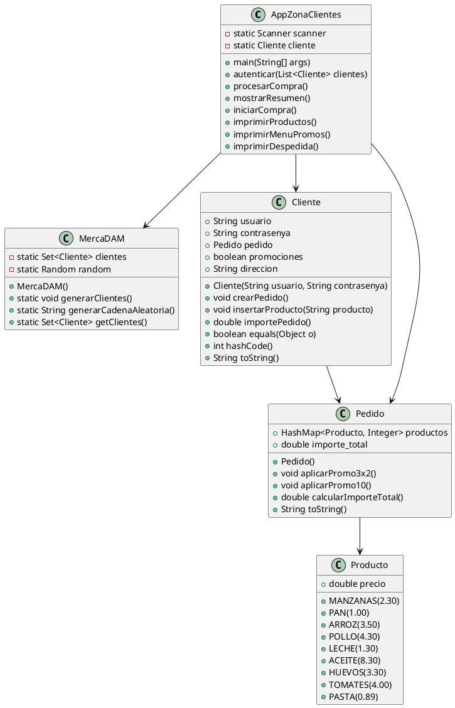

# Práctica: Servicio de compra online

## Índice.

---

1. [Resumen](#resumen)

2. [Estructura de clases](#estructura-de-clases)

3. [Programa Principal](#programa-principal)

4. [Pruebas](#pruebas)

5. [Entrega](#entrega)

## Resumen

> El programa es una aplicación simple de compras en línea para una tienda llamada MercaDAM. Consiste en varias clases que gestionan clientes, productos y pedidos. Las funcionalidades principales incluyen la autenticación de clientes, la selección de productos, el procesamiento de pedidos y la aplicación de promociones.

## Estructura de clases

- **AppZonaClientes**
  
  - Atributos: 
    
    - static Scanner scanner
    
    - static Cliente cliente
  
  - Métodos: 
    
    - main(String[] args)
    
    - autenticar(List<Cliente> clientes)
    
    - procesarCompra()
    
    - mostrarResumen()
    
    - iniciarCompra()
    
    - imprimirProductos()
    
    - imprimirMenuPromos()
    
    - imprimirDespedida()

- **MercaDAM**
  
  - Atributos:
    
    - static Set<Cliente> clientes
    
    - static Random random
  
  - Métodos:
    
    - MercaDAM()
    
    - static void generarClientes()
    
    - static String generarCadenaAleatoria()
    
    - static Set<Cliente> getClientes()

- **Cliente**
  
  - Atributos: 
    
    - String usuario
    
    - String contrasenya
    
    - Pedido pedido
    
    - boolean promociones
    
    - String direccion
  
  - Métodos:
    
    - Cliente(String usuario, String contrasenya)
    
    - void crearPedido()
    
    - void insertarProducto(String producto)
    
    - double importePedido()
    
    - boolean equals(Object o)
    
    - int hashCode()
    
    - String toString()

- **Producto**
  
  - Atributos:
    
    - double precio
  
  - Métodos:
    
    - MANZANAS(2.30)
    
    - PAN(1.00)
    
    - ARROZ(3.50)
    
    - POLLO(4.30)
    
    - LECHE(1.30)
    
    - ACEITE(8.30)
    
    - HUEVOS(3.30)
    
    - TOMATES(4.00)
    
    - PASTA(0.89)

- Pedido
  
  - Atributos: 
    
    - HashMap<Producto, Integer> productos
    
    - double importe_total
  
  - Métodos: 
    
    - Pedido()
    
    - void aplicarPromo3x2()
    
    - void aplicarPromo10()
    
    - double calcularImporteTotal()
    
    - String toString()

### Diagrama de Clases UML

## Programa Principal

- **AppZonaClientes**
  
  - main(String[] args): Inicializa la aplicación, genera clientes, autentica un cliente, procesa la compra, muestra el resumen e imprime el menú de promociones.
  
  - autenticar(List<cliente> clientes)</cliente>: Autentica al usuario verificando el nombre de usuario y la contraseña contra la lista de clientes.
  
  - procesarCompra(): Gestiona el proceso de agregar productos al pedido del cliente.
  
  - mostrarResumen(): Muestra un resumen de la compra del cliente, incluyendo los productos y el monto total.
  
  - iniciarCompra(): Inicializa el proceso de compra creando un nuevo pedido para el cliente.
  
  - imprimirProductos(): Imprime la lista de productos disponibles y sus precios.
  
  - imprimirMenuPromos(): Muestra el menú de promociones y permite al cliente aplicar promociones o finalizar el pedido.
  
  - imprimirDespedida(): Imprime un mensaje de agradecimiento y la dirección de entrega.

- **MercaDAM**
  
  - MercaDAM(): Constructor que inicializa el conjunto de clientes.
  
  - generarClientes(): Genera un conjunto de clientes con nombres de usuario y contraseñas aleatorios.
  
  - generarCadenaAleatoria(): Genera una cadena aleatoria de 8 caracteres.
  
  - getClientes(): Devuelve un conjunto inmodificable de clientes.

- **Cliente**
  
  - Cliente(String usuario, String contrasenya): Constructor que inicializa al cliente con un nombre de usuario, contraseña y valores predeterminados para otros atributos.
  
  - crearPedido(): Crea un nuevo pedido para el cliente si aún no existe uno.
  
  - insertarProducto(String producto): Agrega un producto especificado al pedido del cliente.
  
  - importePedido(): Calcula y devuelve el monto total del pedido del cliente.
  
  - equals(Object o): Verifica si dos clientes son iguales en función de sus atributos.
  
  - hashCode(): Devuelve el código hash del cliente.
  
  - toString(): Devuelve una representación en cadena del cliente.

- **Producto**
  
  - Producto(Double precio): Constructor que inicializa el producto con un precio especificado.
  
  - getPrecio(): Devuelve el precio del producto.

- **Pedido**
  
  - Pedido(): Constructor que inicializa el pedido con una lista de productos vacía y un monto total de 0.
  
  - aplicarPromo3x2(): Aplica una promoción de 3x2 al pedido.
  
  - aplicarPromo10(): Aplica un descuento del 10% al monto total del pedido.
  
  - calcularImporteTotal(): Calcula y devuelve el monto total del pedido.
  
  - toString(): Devuelve una representación en cadena del pedido.

## Pruebas

Video camino feliz:  [Enlace](https://youtu.be/ioS1DUXz4bk)

- Video para mostrar que el programa funciona como debería

Prueba Usuario: [Enlace](https://youtu.be/xJpcNj-vUyo)

- En este video podemos comprobar que al fallar 3 veces el inicio de sesión nos saca del programa

Prueba Pedidos: [Enlace](https://youtu.be/vpEt-IOrNGo)

- Aquí podemos comprobar que si escribimos bien un producto y luego que poner algo que no esta en la lista nos mostrara un mensaje de error de que el producto no existe

## Entrega

[  ] **Código Fuente** : [Enlace](https://github.com/Jose-Manuel05/Estructuras_Datos/tree/main/Colecciones/src/main/java/org/example/MercaDAM)

@pbendom3
